# System Architecture

## Overview
The platform is a real-time video chat application designed with a microservices-oriented architecture. It supports random 1-on-1 chats, private friend calls, and group calls (up to 10 users) with screen sharing and AI moderation.

## Components

### 1. API Gateway
- **Role**: Entry point for all HTTP requests.
- **Tech**: Nginx or Node.js (Express/Fastify) Proxy.
- **Responsibilities**:
  - Rate limiting.
  - Authentication verification (JWT).
  - Routing to appropriate microservices.

### 2. Core Services
#### Auth Service
- **Role**: Manages user identity.
- **Features**: Email-based passwordless login (OTP/Magic Link), JWT issuance.

#### User Service
- **Role**: Manages user profiles and settings.
- **Features**: Profile updates, avatar management, reputation score tracking.

#### Friend Service
- **Role**: Manages social graph.
- **Features**: Friend requests, block lists, private ID lookups.

#### Matchmaking Service
- **Role**: Pairs users for random chat.
- **Tech**: Redis Lists/PubSub.
- **Logic**: Matches users based on reputation score and availability.

### 3. Real-Time Services
#### Signaling Service (WebSocket Gateway)
- **Role**: Handles WebRTC signaling and real-time events.
- **Tech**: Socket.io / ws.
- **Events**: `join-room`, `offer`, `answer`, `ice-candidate`, `leave-room`.

#### SFU Cluster (Media Service)
- **Role**: Selective Forwarding Unit for multi-party calls.
- **Tech**: Mediasoup.
- **Capacity**: Optimized for 10-person mesh/star topology.
- **Features**:
  - Simulcast support.
  - Screen sharing tracks.
  - Audio level observation (active speaker detection).

### 4. Microservices (Workers)
#### AI Moderation Service
- **Role**: Analyzes media streams for violations.
- **Pipeline**:
  - **Video**: Frame sampling every 5s -> Computer Vision Model (NSFW/Violence).
  - **Audio**: Audio buffer -> Speech-to-Text -> NLP (Toxicity) + Audio Event Detection.
  - **Text**: Chat messages -> NLP.

#### RTMP Out Service
- **Role**: Broadcasts calls to external platforms (Twitch/YouTube).
- **Tech**: FFmpeg.
- **Flow**: WebRTC Stream -> FFmpeg Transcode -> RTMP Push.

#### Snapshot Logging Service
- **Role**: Securely stores evidence of violations.
- **Policy**: Stores blurred snapshots for 7-15 days, then auto-deletes.

#### Analytics Service
- **Role**: Tracks usage and behavior.
- **Metrics**: Call duration, extensive disconnects, report rates.

## Interaction Flow

### Random Chat Flow
1. **User** connects to `Signaling Service` via WebSocket.
2. **User** emits `find-match`.
3. **Signaling Service** pushes user to `Matchmaking Service` (Redis Queue).
4. **Matchmaking Service** finds a peer and publishes `match-found`.
5. **Signaling Service** notifies both users with `room-id`.
6. **Users** exchange SDP offers/answers via `Signaling Service`.
7. **P2P Connection** established.

### Group Call Flow
1. **User** creates room -> `Signaling Service` creates room on `SFU`.
2. **User** joins room -> Connects Transport to `SFU`.
3. **User** produces tracks (Video/Audio).
4. **Other Users** join -> Consume tracks from `SFU`.

## Sequence Diagram (Simplified)

```mermaid
sequenceDiagram
    participant Client
    participant Gateway
    participant Signaling
    participant Redis
    participant SFU

    Client->>Gateway: POST /auth/login
    Gateway-->>Client: JWT Token

    Client->>Signaling: Connect (Socket.io + JWT)
    Signaling-->>Client: Connected

    rect rgb(30, 30, 30)
        Note right of Client: Random Chat
        Client->>Signaling: emit('find-match')
        Signaling->>Redis: LPUSH waiting_queue
        Redis-->>Signaling: Match Found (PeerID)
        Signaling-->>Client: emit('match', { peerId, initiator: true })
        Client->>Signaling: emit('offer', sdp)
        Signaling->>Peer: emit('offer', sdp)
    end
```

