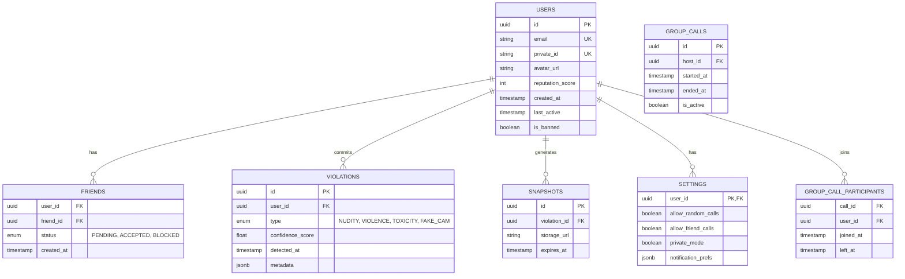

# Database Schema (PostgreSQL)

## ERD Diagram

## Table Definitions

### `users`
| Column | Type | Constraints | Description |
|--------|------|-------------|-------------|
| `id` | UUID | PK, Default: gen_random_uuid() | Unique User ID |
| `email` | VARCHAR(255) | UNIQUE, NOT NULL | User Email (Hidden) |
| `private_id` | VARCHAR(20) | UNIQUE, NOT NULL | Publicly shareable ID |
| `reputation_score` | INT | Default: 100 | Behavior score |

### `friends`
| Column | Type | Constraints | Description |
|--------|------|-------------|-------------|
| `user_id` | UUID | FK -> users.id | Requester |
| `friend_id` | UUID | FK -> users.id | Recipient |
| `status` | ENUM | 'PENDING', 'ACCEPTED', 'BLOCKED' | Relationship status |

### `violations`
| Column | Type | Constraints | Description |
|--------|------|-------------|-------------|
| `id` | UUID | PK | Violation ID |
| `user_id` | UUID | FK -> users.id | Offender |
| `type` | VARCHAR | NOT NULL | Type of violation |
| `evidence_id` | UUID | FK -> snapshots.id | Link to evidence |

### `rtmp_configs`
| Column | Type | Constraints | Description |
|--------|------|-------------|-------------|
| `user_id` | UUID | FK -> users.id | Streamer |
| `stream_key` | VARCHAR | Encrypted | YouTube/Twitch Key |
| `platform` | VARCHAR | 'YOUTUBE', 'TWITCH' | Target Platform |
